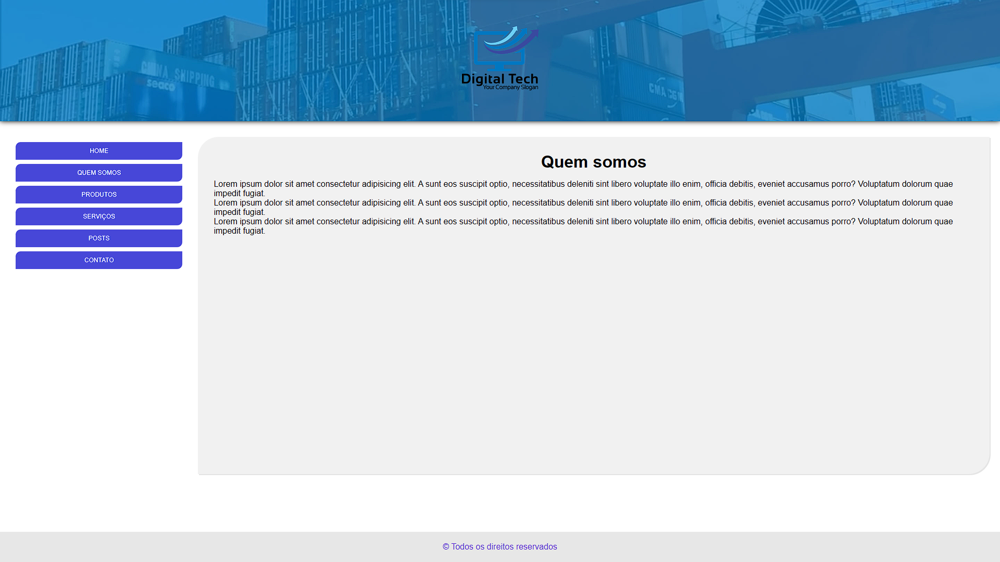
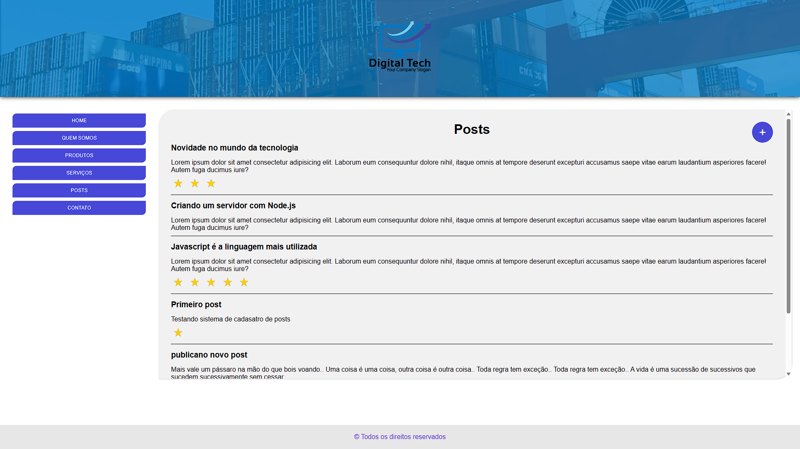
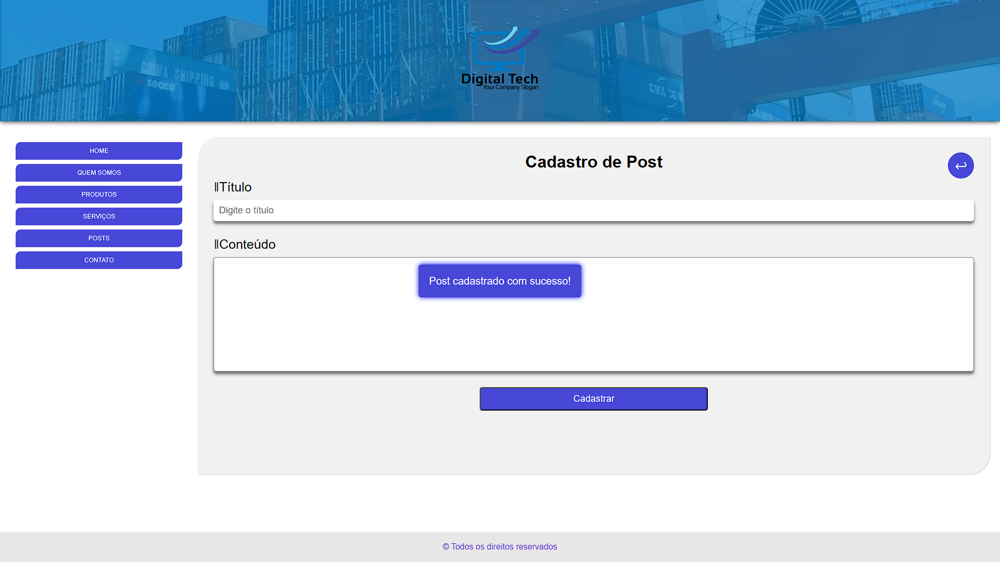

# express-server

## Purpose

The aim of this project was to understand and practise fundamental concepts about how to create a server with the Node.js express module.

Some of the concepts practised were:

- MVC architecture
- Organisation
- Middleware
- Template Engine (EJS)
- Basic modules
    - express
    - fileSystem
    - path
- URI routes
    - GET
    - POST
- JSON manipulation
    - Read
    - Write

## Result Screenshots

